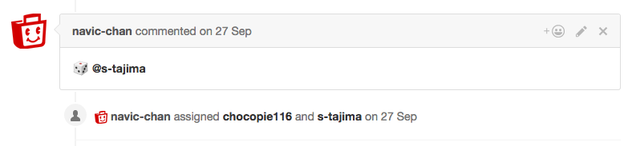

+++
author = "Satoshi Tajima"
categories = ["Tools"]
date = "2016-12-19T00:00:00+09:00"
description = ""
featured = ""
featuredalt = ""
featuredpath = ""
linktitle = ""
title = "GitHubのPull Requestへのレビュアーアサインを自動化するツール「github-dice」の紹介"

+++

ブログ移転のテストです。  
元の記事はこちら。  
http://s-tajima.hateblo.jp/entry/2016/12/19/131319

---

こんにちは、今回はGitHubのPull Requestへのアサインを自動化するツール  
「github-dice」を作成したお話です。  

# 背景

GitHubのPull Requestベースの開発をする際、コードレビューはとても大事な工程の一つです。  
  
よくあるコードレビューは、 **技術力の高い/システムの理解度が深い/ベテラン** のメンバーが、**技術力の低い/システムの理解度の浅い/若手** のメンバーが書いたコードをレビューするようなやり方かなと思います。  
  
しかしコードレビューは、レビューを受ける側(レビュイー)にとってとても良い成長の機会ですが、同時にレビューをする側(レビュアー)にとっても良い成長の機会となります。
自分より実力の高い人の書いたコードをレビューすることで、新しい知見を得て、技術力の向上に繋げることができます。  
システムの理解の深い人間が増えることは、システムの属人性を減らすことにも繋がるでしょう。  
  
そこで、僕の所属しているチームでは、技術力/システムの理解度/在籍期間等に関係なく、チームのメンバーが均等にレビュアーの機会を経験できるような運用を行っています。  
  

# github-dice

[github-dice](https://github.com/s-tajima/github-dice)

github-diceは、GitHubのPull Requestへのレビュアーのアサインを自動化するためのツールです。  
あらかじめ指定した[Team](https://help.github.com/articles/setting-up-teams/)のメンバーから、サイコロを振るようにランダムにレビュアーを選出しアサインします。  
  
導入方法、使い方はREADMEに記載の通りです。  
Golang製のツールなのでバイナリを配置するだけで使用できます。  
github-diceを使用すると、以下のようにコメントと共にレビュアーがアサインされます。  
(オプションで起票者を同時にアサインすることもできます。)  

尚、`-q, --query` オプションで検索クエリを書き換えられるので、Pull Requestだけでなく、Issueを自動アサインの対象にすることも可能です。  

# 終わりに

技術的知見があまりなく、業務用件の理解も浅いコードをいきなりレビューするのはそれなりに負担が高いです。  
「チームのメンバーが均等にレビュアーの機会を経験できるように」という方針だけ立ててあとは各メンバーの自主性に任せるというやり方では結局うまく回らなそうだと考え、ランダムにレビュアーを選出し機械的にアサインをするというアプローチをとりました。

自信のないときにはしっかり他のメンバーのサポートも受けられる体制も合わせた運用をすることで、過度に心理的, 技術的な負荷のかかるレビューをしなければいけない状況を避けられるようにしています。
(僕も大いに助けられています。)  

実際に半年ほど運用を続けていますが、自分が直接は触らないようなコードの理解も深まり、最初は大きかった負担もだんだん小さくなっていくのを感じています。

以上、簡単ですがgithub-diceの紹介でした。  
ぜひ使ってみてください。Pull Requestもお待ちしております。  

# 余談

先日、GitHubはPull Requestに対してAssigneesとは別にReviewersを割り当てられるようになりました。  
https://github.com/blog/2291-introducing-review-requests

ちょうどこの記事を書いているタイミングで、このReviewersに対するAPIもEarly Accessが開始されました。  
https://developer.github.com/changes/2016-12-16-review-requests-api/

github-diceも近いうちにこの機能に対応しようと考えています。
