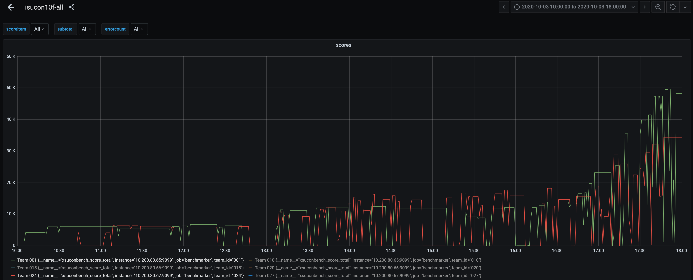

+++
author = "Satoshi Tajima"
categories = [ "ja", "" ]
date = "2020-10-05T14:00:00+09:00"
description = ""
featured = ""
featuredalt = ""
featuredpath = ""
linktitle = ""
title = "ISUCON10本選に参加してX位(KLab賞)でした - 一口坂46"

+++


10月3日に行われたISUCON10に、チーム 一口坂46 として参加しました。  
結果としてはX位で、KLab賞をいただききました！  

私は主にOS/ミドルウェア周り・ベンチマーク実行・ボトルネック分析あたりをやっていたのでそのあたりでどんなことをやっていたかを書こうと思います。チーム一口坂46全体としてどんなことをやったかは、チームメンバーの @yamiのブログ と @atushiのブログ を読むとわかるようになっています。  

リポジトリはこちらです。  
https://github.com/s-tajima/isucon10f-hz46

ちなみに、予選の振り返りブログはこちらです。  
https://medium.com/finatext/isucon10-qual-fcf6590556c0

# 事前準備

多くの準備は予選の時と同じだったのですが、予選ではあまり活用されず、本選ではじめて役に立ったものを紹介します。

## Nginxのログ設定

ログをLTSVにしてalpで分析しやすい状態にしつつ、キャッシュの状況、圧縮の状況を確認するために3つのLogFormatを用意して、常時3つのファイルにログを吐く準備をしてありました。設定としてはこんな感じです。

```
log_format general
    "time:$time_local"
    "\thost:$remote_addr"
    "\tforwardedfor:$http_x_forwarded_for"
    "\treq:$request"
    "\tstatus:$status"
    "\tmethod:$request_method"
    "\turi:$request_uri"
    "\tsize:$body_bytes_sent"
    "\treferer:$http_referer"
    "\tua:$http_user_agent"
    "\treqtime:$request_time"
    "\tcache:$upstream_http_x_cache"
    "\truntime:$upstream_http_x_runtime"
    "\tapptime:$upstream_response_time"
    "\tvhost:$host";

log_format cache
    "time:$time_local"
    "\tmethod:$request_method"
    "\turi:$request_uri"
    "\tr_ims:$http_if_modified_since"
    "\tr_inm:$http_if_none_match"
    "\ts_cc:$sent_http_cache_control"
    "\ts_et:$sent_http_etag"
    "\ts_lm:$sent_http_last_modified"
    "\tstatus:$status"
    "\tsize:$body_bytes_sent";

log_format deflate
    "time:$time_local"
    "\tmethod:$request_method"
    "\turi:$request_uri"
    "\tr_ae:$http_accept_encoding"
    "\ts_ce:$sent_http_content_encoding"
    "\ts_ct:$sent_http_content_type"
    "\ts_cl:$sent_http_content_length"
    "\tstatus:$status"
    "\tsize:$body_bytes_sent";

access_log  /var/log/isucon/nginx-access.log general;
access_log  /var/log/isucon/nginx-access-cache.log cache;
access_log  /var/log/isucon/nginx-access-deflate.log deflate;
#access_log  off;
```

これにより、必要な情報をawkやgrep等で整形して表示するなどの手間が少し削減されます。

# 当日

予選のときは割と堅実にコミットログやチャットに記録を残しながら進められてたのでうまく時系列で整理できたのですが、今回はかなりバタバタしていて丁寧に記録が残せてないのでやったことを純粋にリストアップします。  
細かいので個別には書かないですが、この他にカーネルパラメータやMySQLサーバの設定の調整をして、OSのリソース消費によるエラーやボトルネックとなる処理の排除とかをやったりもしていました。

## Envoy → Nginx への入れ替え

出題者のクックパッドさんでは [テックブログの記事](https://techlife.cookpad.com/entry/2020/06/30/140000) 等から社内でEnvoyが使われることは知っていたので、出題されるかもなとうっすら思ってはいました。  
Envoyは検証程度に触ったことはあるものの、ISUCONで使いこなせるほどチューニングの知識を持っていなかったので、早々に使い慣れたNginxに置き換えることを考えました。(これができないと事前準備したログの設定や分析の仕組みがすぐに使えないというのもあります。)

Nginxの設定をするにあたっては、

* UpstreamにgRPCを指定する
* HTTP/2, TLSでの配信の設定をする

という部分は事前準備していませんでしたが、わりとサクッと終わらせることができました。(特にgRPCの部分が一発でうまく動いたので良かった。)  

最初にNginxを設定したとき、443番のTLS用の設定しかしてなかったのですが、ラスト10分で80番の設定をしてないけど大丈夫か？と気づき、レギュレーションを確認 → 明確にわからなかったので運営に確認 → 回答できないといわれたのでリダイレクトの設定 というのをドタバタとやりました。かなり心臓に悪かったです。

## GET /api/audience/dashboard のキャッシュ

当日マニュアル上、最大1秒は古い情報をかえすことができると合ったので、Nginxでproxy_cacheをするようにしました。  
Nginxの [proxy_cache_valid では、ms単位のTTLが設定できず](https://trac.nginx.org/nginx/ticket/1505)、若干ベンチマークが不安定になってしまい、アプリ側でのキャッシュに切り替えることも考えましたが、結局ここは最後までこのままでした。

## /packs/\*.js, /packs/\*.css のキャッシュ

早期にNginxに入れ替えることができたので、Nginx周りの設定は楽勝... と思ってたのですが、このキャッシュの設定で少しつまりました。

レギュレーションによると

> 実ベンチマーカーは一般的なブラウザの挙動を模した Conditional GET に対応しています。

とのことで、キャッシュ関連のHTTPヘッダを調整する必要がありそうなことがわかります。/packs/\*.js, /packs/\*.css は、デフォルトではGoのアプリケーションから配信するようになっています。これをNginxだけで配信し、かつ304を返せるようにしようとしたのですが、なぜかうまくいきませんでした。なにかの勘違いだったかもしれないですが、 expires ディレクティブで `Cache-Control` と `Expires` を両方セットしていると (どちらも正しくキャッシュされる設定になっているにも関わらず) クライアントがキャッシュしてくれてないように見えました。(実際は何か他の要因を見落としていたかもしれない。) 最終的には `Cache-Control` のみ返すようにして正しくキャッシュされるようになりました。

## サーバー構成の組み換え

結論として、弊チームは予選・本選ともに1台使わず2台構成となりました。(本来3台使いたかったが3台目のいい感じな使い方を検討する暇がないまに終わってしまった。)
構成としては、

* 1号機を 未使用
* 2号機を Nginx + Go(api) + Go(web) + benchmarker
* 3号機を MySQL

としていました。

今回、3台ともスペックが違う構成だったので、2号機と3号機を逆にするなどのトライもしていたりしました。

ちなみに、コンテスト終了後の感想戦で、

* 1号機を Go(api) + Go(web) + benchmark_server
* 2号機を Nginx + Go(api) + Go(web) + benchmark_server
* 3号機を MySQL

という感じでさくっと3台構成したら 38000点 くらいになりました。

# 結果

スコアの推移はこんな感じです。赤が弊チームです。せっかくなので緑で優勝した @takonomura さんのスコアも表示してみました。ラスト1時間のスコアの伸ばしかたで一気に置いていかれてるのがわかりますね。悔しい。



# 最後に

過去にも何度かISUCONには参加していたのですが、予選突破あと少しの惜しい年もあればまったく歯が立たずで終わる年もありました。今回初めて決勝に行けたのですが、順位としてはX位とそこそこの結果が残せてよかったです。  

... などとぬるいことを言わずに来年こそは優勝できるようにがんばります！！  
運営に関わって頂いた皆さん、本当にお疲れ様でした & ありがとうございました！

